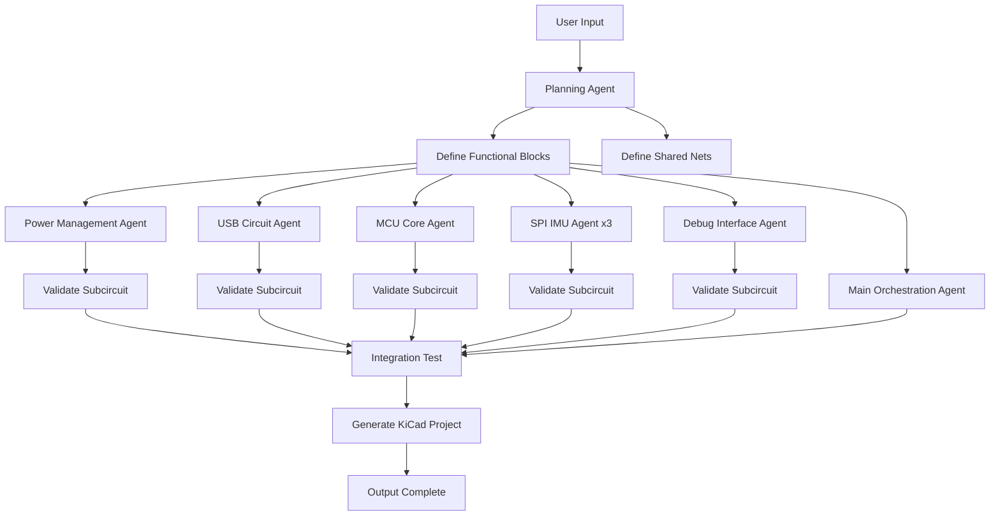

# PRD: Parallel Circuit Generation Pipeline

## 🎯 Product Overview

**Product Name**: Parallel Circuit Generation Pipeline  
**Target Users**: Circuit designers using circuit-synth with Claude Code  
**Problem Statement**: Current circuit generation is slow (6+ minutes), runs agents serially, and often fails to produce actual output files  
**Solution**: Parallel agent architecture that generates subcircuits simultaneously and validates each component independently

## 🚀 Goals & Success Metrics

### Primary Goals
1. **Speed**: Reduce circuit generation time from 6+ minutes to <2 minutes
2. **Reliability**: 95%+ success rate for circuit output generation
3. **Parallelization**: Multiple subcircuits generated simultaneously
4. **Validation**: Every subcircuit tested in isolation before integration

### Success Metrics
- **Performance**: <2 minutes total generation time for standard circuits
- **Success Rate**: 95%+ projects generate working KiCad files
- **Parallel Efficiency**: 3-5x speedup vs serial execution
- **User Satisfaction**: Single command generates complete, working circuits

## 📋 Core Requirements

### Functional Requirements

#### FR1: Planning Agent (Sonnet-powered)
- **Input**: Natural language circuit description (e.g., "STM32 with 3 IMUs on separate SPI, add USB-C")
- **Output**: Functional block breakdown and shared net specifications
- **Breakdown Pattern**: 
  1. Power Management (USB-C input → 3.3V regulation)
  2. USB-C Circuit (with ESD protection)
  3. MCU Core (STM32 with decoupling/programming)
  4. Repeated Subcircuits (e.g., SPI IMU Array called 3 times)
  5. Debug Interface (SWD programming header)
- **Net Interface Definition**: Both power (`VCC_3V3`, `GND`) and signals (`SPI1_MISO`, `SPI1_MOSI`, etc.)

#### FR2: Parallel Subcircuit Generation
- **Execution**: Multiple `Task()` calls in single message for maximum parallelization
- **Agents**: Each subcircuit uses `circuit-generation-agent` or specialized agents
- **Component Search**: Each agent performs independent component sourcing (JLCPCB/DigiKey)
- **Output**: One `.py` file per subcircuit with proper `@circuit` decorator
- **Validation**: Each subcircuit must compile and execute independently

#### FR3: Main Circuit Orchestration
- **Generator**: Dedicated agent creates `main.py` that imports all subcircuits
- **Net Management**: Defines shared nets and passes them to subcircuit functions
- **Integration**: Calls `generate_kicad_project()` for complete circuit assembly
- **Validation**: Tests complete circuit compilation before output

#### FR4: Individual Subcircuit Validation
- **Testing Logic**: Each subcircuit generates temporary `test_[subcircuit].py`
- **Validation**: Runs `uv run python test_[subcircuit].py` to verify compilation
- **Retry**: Max 3 attempts to fix syntax/import errors per subcircuit
- **Success Criteria**: Subcircuit executes without errors and creates circuit object

#### FR5: Command Interface
- **Location**: `/Users/shanemattner/Desktop/circuit-synth3/example_project/.claude/commands/generate_circuit_no_interaction.md`
- **Usage**: `/generate_circuit_no_interaction "STM32 with 3 IMUs on SPI, add USB-C"`
- **Parameters**: Single string description (no complexity levels or options)
- **Output**: Complete project directory with KiCad files ready for manufacturing

### Non-Functional Requirements

#### NFR1: Performance
- **Target**: <2 minutes total execution time
- **Parallel Execution**: Agents must run simultaneously, not sequentially
- **Caching**: Component searches cached to avoid duplicate API calls
- **Efficiency**: No blocking operations between independent subcircuits

#### NFR2: Reliability
- **Fault Tolerance**: Individual subcircuit failures don't block others
- **Error Recovery**: Automatic retry with syntax/import fixes
- **Validation**: Every output tested before user delivery
- **Rollback**: Failed generations cleaned up automatically

#### NFR3: Output Quality
- **Standards**: Professional circuit-synth code following existing patterns
- **Manufacturing**: All components verified available on JLCPCB
- **Documentation**: Generated files include proper docstrings and comments
- **Hierarchy**: Clean hierarchical structure matching examples

## 🏗️ System Architecture

### Agent Workflow



### File Structure Output

```
project_name/
├── main.py                 # Main orchestration (generated by main agent)
├── power_management.py     # Generated by power agent
├── usb_circuit.py         # Generated by USB agent  
├── mcu_core.py            # Generated by MCU agent
├── spi_imu.py             # Generated by IMU agent (reused 3x)
├── debug_interface.py     # Generated by debug agent
├── project_name.kicad_pro # KiCad project file
├── project_name.kicad_sch # Hierarchical schematic
├── project_name.kicad_pcb # PCB layout
├── project_name.net       # Netlist file
└── project_name.json      # JSON netlist
```

### Agent Responsibilities

#### Planning Agent (Sonnet)
- **Input**: Natural language circuit description
- **Processing**: Break down into functional blocks using examples and patterns
- **Output**: Launch 5-7 parallel `Task()` calls with detailed subcircuit specifications
- **Examples**: Trained on existing circuit-synth examples + manually created edge cases

#### Subcircuit Generation Agents
- **Input**: Subcircuit specification with net interface
- **Processing**: Component search → Code generation → Syntax validation
- **Output**: Working `.py` file with `@circuit` decorator and proper connections
- **Validation**: Must pass `uv run python test_subcircuit.py` before completion

#### Main Orchestration Agent  
- **Input**: List of completed subcircuits and net specifications
- **Processing**: Generate `main.py` that imports and connects all subcircuits
- **Output**: Complete main file with `generate_kicad_project()` call
- **Integration**: Final test of complete circuit compilation

## 🧪 Validation Strategy

### Level 1: Subcircuit Validation
```python
# For each subcircuit (e.g., power_management.py)
# Auto-generated test file:

from circuit_synth import *
from power_management import power_management

def test_power_management():
    vbus = Net('VBUS')
    vcc_3v3 = Net('VCC_3V3') 
    gnd = Net('GND')
    
    circuit = power_management(vbus, vcc_3v3, gnd)
    print(f"✅ Power management circuit created: {circuit}")

if __name__ == "__main__":
    test_power_management()
```

### Level 2: Integration Validation
```python
# In main.py - must execute without errors
circuit = main_circuit()
circuit.generate_kicad_project(project_name, generate_pcb=True)
```

### Level 3: Output Validation
- Verify KiCad files exist and are non-empty
- Check netlist contains expected components and connections
- Validate that all components have valid symbols/footprints

## 🎮 User Experience

### Command Usage
```bash
# Single command generates complete project
/generate_circuit_no_interaction "STM32G431 with 3 ICM-20948 IMUs on separate SPI buses, USB-C power input"

# Output shows parallel progress
🧠 Planning Agent: Breaking down into 6 functional blocks...
⚡ Parallel Generation: 
   - Power Management Agent: Searching components...
   - USB Circuit Agent: Generating ESD protection...  
   - MCU Agent: Found STM32G431CBT6 in stock...
   - SPI IMU Agent: Generating IMU subcircuit...
   - Debug Agent: Creating SWD interface...
   - Main Agent: Orchestrating connections...

✅ Generated: stm32g431_triple_imu_board/
   📁 5 subcircuit files + main.py
   🎯 KiCad project ready for manufacturing
   ⚡ Completed in 1m 23s
```

### Error Handling
- Individual subcircuit failures reported but don't stop others
- Automatic retry with improved prompts
- Clear error messages with suggested fixes
- Graceful degradation (manual intervention options)

## 🚧 Implementation Phases

### Phase 1: Foundation (Week 1)
- [ ] Create `/generate_circuit_no_interaction` command
- [ ] Implement planning agent with functional block breakdown
- [ ] Collect and structure existing examples for training
- [ ] Design shared net specification format

### Phase 2: Parallel Architecture (Week 2) 
- [ ] Implement parallel `Task()` execution pattern
- [ ] Create subcircuit generation agent templates
- [ ] Build individual subcircuit validation system
- [ ] Test with simple 2-3 block circuits

### Phase 3: Integration & Testing (Week 3)
- [ ] Implement main orchestration agent
- [ ] Add complete integration validation
- [ ] Test with complex circuits (5+ subcircuits)
- [ ] Performance optimization and error handling

### Phase 4: Production Ready (Week 4)
- [ ] Edge case testing and manual examples
- [ ] Documentation and usage guides
- [ ] Performance benchmarks vs current system
- [ ] User acceptance testing

## 📊 Success Measurement

### Performance Benchmarks
| Circuit Complexity | Current Time | Target Time | Success Rate Target |
|-------------------|--------------|-------------|-------------------|
| Simple (2-3 blocks) | 3-4 minutes | <1 minute | 98% |
| Medium (4-5 blocks) | 6-8 minutes | <2 minutes | 95% |
| Complex (6+ blocks) | 10+ minutes | <3 minutes | 90% |

### Quality Metrics
- **Component Availability**: 100% JLCPCB verified components
- **KiCad Compatibility**: 100% projects open without errors
- **Code Quality**: Pass all linting/type checking
- **Manufacturing Ready**: 95% generate valid Gerber files

## 🎯 Out of Scope (V1)

- Interactive mode with user questions (`/generate_circuit_INTERACTIVE` - future)
- Custom component libraries or non-JLCPCB parts
- Advanced PCB layout optimization
- Multi-board systems or flexible PCB
- Cost optimization beyond basic component selection

## 🔍 Risk Assessment

### High Risk
- **Agent coordination complexity**: Multiple agents must coordinate shared nets correctly
- **Parallel execution reliability**: Task failures could leave partial results

### Medium Risk  
- **Performance regression**: Parallel overhead might not improve total time
- **Component conflicts**: Different agents might select incompatible parts

### Low Risk
- **Command interface**: Standard Claude Code slash command pattern
- **Output format**: Reusing existing circuit-synth generation patterns

## 📚 Dependencies

### Technical Dependencies
- Claude Code Task tool with parallel execution support
- Existing circuit-synth library and validation systems
- JLCPCB/DigiKey API integrations
- KiCad symbol/footprint libraries

### Agent Dependencies  
- Sonnet access for planning agent (higher reasoning capability)
- Multiple simultaneous agent sessions (parallel execution)
- Specialized circuit-generation-agent implementation
- Component sourcing agents (jlc-parts-finder, component-guru)

---

**This PRD defines a complete parallel circuit generation system that addresses the current performance and reliability issues while maintaining the high-quality output standards of circuit-synth.**