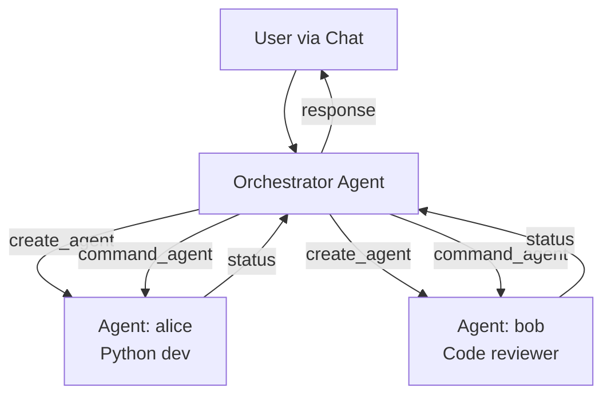
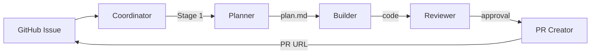
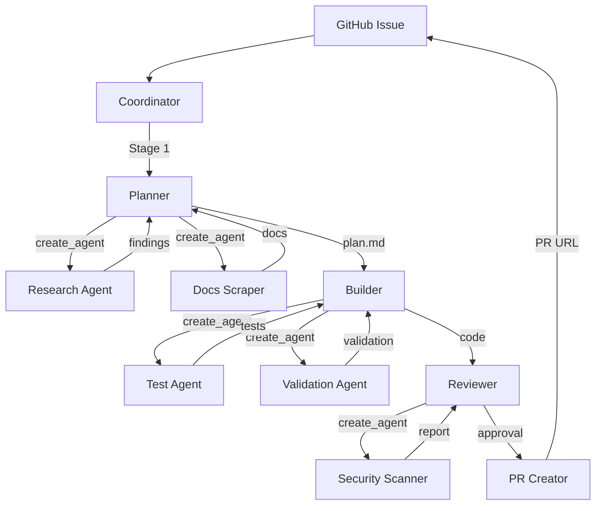

# TAC System Comparison: circuit-synth vs multi-agent-orchestration

**Date:** 2025-11-03
**Purpose:** Deep analysis comparing our TAC-X pipeline with multi-agent-orchestration system
**Recommendation Priority:** High-Impact, Medium-Impact, Low-Impact, Consider, Research

---

## Executive Summary

### What They Have (multi-agent-orchestration)
- **Full-stack web UI** with real-time WebSocket streaming
- **PostgreSQL persistence** for all agent events, chat, and costs
- **Meta-agent pattern** - Orchestrator creates and commands subordinate agents dynamically
- **MCP server** with 8 management tools for agent lifecycle
- **3-column UI** - Agent sidebar, Event stream, Orchestrator chat
- **Comprehensive observability** - Every hook, tool use, and response captured
- **Session resumption** - Continue work across restarts
- **Subagent template system** - Reusable agent configurations with YAML frontmatter

### What We Have (circuit-synth TAC-X)
- **Fixed 4-stage pipeline** - Planning → Building → Reviewing → PR Creation
- **GitHub issue-driven** - All work starts from GitHub issues with `tac` label
- **Multi-provider support** - OpenRouter integration for Claude, Gemini, Grok, etc.
- **Workflow configuration** - YAML-based per-stage provider/model selection
- **Coordinator daemon** - Polls GitHub for issues, manages git worktrees
- **Stage handoff** - Structured data flow between pipeline stages
- **Token budget monitoring** - Cost tracking and budget enforcement
- **File-based state** - JSONL logs in `.tac/` directory

---

## Detailed Comparison

### 1. Architecture Pattern

| Aspect | multi-agent-orchestration | circuit-synth TAC-X | Winner |
|--------|---------------------------|---------------------|---------|
| **Pattern** | Meta-agent (orchestrator creates agents on demand) | Fixed pipeline (4 sequential stages) | Tie - different use cases |
| **Flexibility** | High - agents created dynamically for any task | Low - hardcoded 4-stage workflow | Them |
| **Predictability** | Lower - orchestrator decides what agents to create | Higher - always same 4 stages | Us |
| **Specialization** | Agents created with custom system prompts | Stages have fixed, specialized prompts | Tie |

**Recommendation:** 🔴 **HIGH-IMPACT** - Consider hybrid approach

### 2. User Interface

| Aspect | multi-agent-orchestration | circuit-synth TAC-X | Winner |
|--------|---------------------------|---------------------|---------|
| **UI Type** | Full-stack web app (Vue 3 + FastAPI) | CLI + GitHub labels | Them |
| **Real-time Updates** | WebSocket streaming, sub-second latency | Poll-based (30s intervals) | Them |
| **Visibility** | 3 columns: agents, events, chat | Git logs + `.tac/` directory | Them |
| **Interaction** | Natural language chat with orchestrator | GitHub issue comments | Them |
| **Cost Tracking** | Live USD costs in header, per-agent breakdown | Post-run analysis tool | Them |

**Recommendation:** 🔴 **HIGH-IMPACT** - Add web dashboard for TAC system

### 3. Persistence & State

| Aspect | multi-agent-orchestration | circuit-synth TAC-X | Winner |
|--------|---------------------------|---------------------|---------|
| **Database** | PostgreSQL with 6 tables | File-based JSONL logs | Them |
| **State Recovery** | Session resumption via `--session` flag | Restart from last completed stage | Them |
| **Event Logging** | Every hook, tool use, message captured | Stage execution logs only | Them |
| **Chat History** | Full 3-way conversation (user/orch/agents) | GitHub issue comments | Them |
| **Query Ability** | SQL queries on all historical data | Grep/parse JSONL files | Them |

**Recommendation:** 🟠 **MEDIUM-IMPACT** - Add PostgreSQL backend for TAC logs

### 4. Agent Management

| Aspect | multi-agent-orchestration | circuit-synth TAC-X | Winner |
|--------|---------------------------|---------------------|---------|
| **Agent Lifecycle** | Dynamic - create/delete on demand | Static - 4 fixed stages | Them |
| **Agent Types** | Unlimited - orchestrator creates any type | 4 types: planner, builder, reviewer, pr_creator | Them |
| **Tools Available** | 8 MCP management tools | GitHub API, git, file operations | Tie |
| **Parallel Execution** | Yes - multiple agents running concurrently | No - sequential stages only | Them |
| **Template System** | Subagent templates in `.claude/agents/*.md` | Fixed prompts in `adws/prompts/*.md` | Them (more flexible) |

**Recommendation:** 🔴 **HIGH-IMPACT** - Implement agent template system

### 5. Observability

| Aspect | multi-agent-orchestration | circuit-synth TAC-X | Winner |
|--------|---------------------------|---------------------|---------|
| **Event Capture** | PreToolUse, PostToolUse, ThinkingBlock, etc. | Stage start/complete + LLM responses | Them |
| **File Tracking** | Git diffs captured automatically in PostToolUse | Manual tracking in stage logs | Them |
| **AI Summaries** | 15-word AI summaries for all events (Claude Haiku) | None | Them |
| **Live Monitoring** | WebSocket broadcast to all clients | `tail -f coordinator.log` | Them |
| **Cost Analysis** | Real-time per-agent + total cost in UI | Post-run Python script analysis | Them |

**Recommendation:** 🟠 **MEDIUM-IMPACT** - Add real-time event capture and AI summaries

### 6. Workflow Configuration

| Aspect | multi-agent-orchestration | circuit-synth TAC-X | Winner |
|--------|---------------------------|---------------------|---------|
| **Workflow Definition** | Agent templates with YAML frontmatter | YAML workflow config with stages | Us (more structured) |
| **Per-Stage Config** | Per-agent system prompt, tools, model | Per-stage provider/model/temp/fallback | Us |
| **Multi-Provider** | Via provider specified in agent creation | OpenRouter integration with fallback | Us |
| **Fallback Logic** | Not explicitly supported | Fallback models per stage | Us |
| **Visualization** | None | Mermaid diagram generation | Us |

**Recommendation:** ✅ **LOW-IMPACT** - Our workflow config is already good

### 7. Error Handling

| Aspect | multi-agent-orchestration | circuit-synth TAC-X | Winner |
|--------|---------------------------|---------------------|---------|
| **Error Recovery** | Agent interruption + restart | Stage retry logic | Tie |
| **Error Visibility** | WebSocket broadcast + DB logging | Coordinator logs + GitHub status | Them (better UX) |
| **Error Types** | Hook-based error capture | Exception handling in stages | Tie |
| **Debugging** | Full event replay from DB | JSONL log analysis | Them |

**Recommendation:** 🟠 **MEDIUM-IMPACT** - Enhance error visibility

### 8. Testing & Development

| Aspect | multi-agent-orchestration | circuit-synth TAC-X | Winner |
|--------|---------------------------|---------------------|---------|
| **Test Philosophy** | Real DB + Real Claude SDK (no mocking) | Integration tests with real LLMs | Us (same philosophy) |
| **Test Coverage** | 5/5 backend tests passing | Test plan created, not implemented | Them (implemented) |
| **Development Workflow** | Astral UV, no raw python | Poetry + pytest | Tie |
| **Documentation** | Extensive - 10+ markdown docs | Test plan + workflow analysis | Them |

**Recommendation:** 🔴 **HIGH-IMPACT** - Implement TAC regression test suite

---

## Slash Commands & Agent Templates

### Their Slash Commands (23 total)

**Workflow Commands:**
- `/plan` - Create detailed implementation spec
- `/build` - Implement plan top-to-bottom with validation
- `/scout` - Investigate codebase, identify issues
- `/scout_plan_build` - Three-phase: scout → plan → build
- `/orch_scout_and_build` - Two-phase with orchestrator
- `/orch_plan_w_scouts_build_review` - Full four-phase workflow
- `/orch_one_shot_agent` - Create agent, execute task, delete
- `/question` - Answer questions without making changes
- `/prime` - Analyze codebase structure

**Documentation Commands:**
- `/load_ai_docs` - Scrape docs URLs to markdown
- `/load_bundle` - Load doc bundles

**Parallel Execution:**
- `/build_in_parallel` - Implement specs in parallel
- `/parallel_subagents` - Launch multiple sub-agents

### Their Agent Templates (6 total)

- `build-agent.md` - Implements single files from specs in parallel
- `docs-scraper.md` - Fetches and saves docs as markdown
- `meta-agent.md` - Generates new sub-agent config files
- `playwright-validator.md` - Web validation with screenshots
- `review-agent.md` - Git diff analysis with risk tiers
- `scout-report-suggest.md` - Codebase investigation and reporting

### Our Slash Commands (11 total)

**Testing & Verification:**
- `/dev:run-tests` - Execute test suite with coverage
- `/dev:review-branch` - Comprehensive branch review
- `/dev:review-repo` - Full repository analysis
- `/dev:dead-code-analysis` - Find unused code

**Release Workflow:**
- `/dev:release-pypi` - Release to PyPI
- `/dev:release-testpypi` - Test release on TestPyPI

**Commit Workflow:**
- `/dev:update-and-commit` - Document + commit changes

**Documentation:**
- `/dev:validate-docs` - Validate docs alignment
- `/dev:review-prompt` - Review prompts for best practices

**Analysis:**
- `/dev:compare-three-repos` - Compare circuit-synth repos

---

## High-Impact Recommendations

### 1. 🔴 Add Web Dashboard for TAC System

**What:** Build a lightweight web UI for TAC coordinator

**Why:**
- Real-time visibility into running tasks
- Live cost tracking during execution
- Event stream shows what each stage is doing
- Better debugging experience

**Implementation:**
```
/adws/
  /dashboard/
    main.py           # FastAPI backend (port 9500)
    /frontend/        # Vue 3 frontend (port 5176)
      /src/
        App.vue       # 2-column: task list + event stream
        stores/
          tacStore.ts # Task state, events, costs
```

**Effort:** 3-4 hours (reuse their Vue components)

**Impact:** 10x better visibility into TAC system

---

### 2. 🔴 Implement Agent Template System

**What:** Support dynamic agent creation with templates like they do

**Why:**
- Reusable agent configurations
- Easy to create new specialized agents
- Community can share agent templates
- More flexible than hardcoded 4-stage pipeline

**Implementation:**
```yaml
# .claude/agents/circuit-validator.md
---
name: circuit-validator
description: Validates circuit schematics for electrical correctness
tools: Read, Grep, Bash
model: sonnet
temperature: 0.3
---

# circuit-validator

You are a circuit validation specialist...
```

**Effort:** 2 hours (implement template loader + injection)

**Impact:** Unlock dynamic agent creation

---

### 3. 🔴 Add Hybrid Architecture: Fixed Pipeline + Dynamic Agents

**What:** Keep 4-stage pipeline BUT allow orchestrator to spawn helper agents

**Why:**
- Best of both worlds: predictable flow + flexibility
- Planner could spawn "research-agent" to gather context
- Builder could spawn "test-agent" to write tests in parallel
- Reviewer could spawn "security-agent" for specialized checks

**Implementation:**
```python
# In multi_stage_worker.py - Planning stage
def run_planning_stage(self):
    # Run planner agent
    result = self.invoke_stage("planning", prompt)

    # Planner can now use create_agent() tool
    # to spawn helper agents if needed

    # Example: "I need to research the kicad-sch-api docs"
    # → Planner creates "docs-scraper" agent
    # → Docs-scraper fetches and summarizes
    # → Planner incorporates into plan
```

**Effort:** 5-6 hours (add MCP server with create_agent tool)

**Impact:** Massive flexibility increase

---

### 4. 🔴 Implement TAC Regression Test Suite

**What:** Complete the test plan we created

**Why:**
- Currently have plan but no implementation
- Need to verify TAC system works end-to-end
- Prevent regressions as we add features
- Build confidence in system reliability

**Implementation:**
```python
# tests/tac/test_pipeline_execution.py
def test_single_stage_pipeline():
    """Test 1: Single-stage pipeline execution"""
    workflow = WorkflowConfig(
        stages=[StageConfig(name="planning", ...)]
    )
    worker = MultiStageWorker(...)
    state = worker.run()
    assert state.status == "completed"
    assert "planning" in state.completed_stages
```

**Effort:** 4-5 hours (implement 10 test scenarios)

**Impact:** Confidence in TAC reliability

---

## Medium-Impact Recommendations

### 5. 🟠 Add PostgreSQL Backend for TAC Logs

**What:** Store TAC events in PostgreSQL like they do

**Why:**
- Queryable history of all tasks
- Better than JSONL file parsing
- Enable analytics and reporting
- Foundation for web dashboard

**Schema:**
```sql
CREATE TABLE tac_tasks (
  id UUID PRIMARY KEY,
  issue_number VARCHAR,
  status VARCHAR,
  current_stage VARCHAR,
  total_cost DECIMAL,
  created_at TIMESTAMP
);

CREATE TABLE tac_stage_logs (
  id UUID PRIMARY KEY,
  task_id UUID REFERENCES tac_tasks(id),
  stage_name VARCHAR,
  event_type VARCHAR,  -- hook, response, tool_use
  content TEXT,
  payload JSONB,
  timestamp TIMESTAMP
);
```

**Effort:** 3 hours (migrations + async queries)

**Impact:** Foundation for future features

---

### 6. 🟠 Add Real-Time Event Capture with AI Summaries

**What:** Capture hook events and generate AI summaries like they do

**Why:**
- Better observability during execution
- AI summaries make logs scannable
- Easier to debug issues
- Better UX in web dashboard

**Implementation:**
```python
# In multi_stage_worker.py
def on_pre_tool_use(tool_name: str, args: dict):
    """Hook: Before tool execution"""
    summary = generate_ai_summary(f"Using {tool_name} with {args}")
    log_event("hook", "PreToolUse", summary, payload={...})

def on_post_tool_use(tool_name: str, result: str):
    """Hook: After tool execution"""
    summary = generate_ai_summary(f"{tool_name} result: {result[:100]}")
    log_event("hook", "PostToolUse", summary, payload={...})
```

**Effort:** 2 hours (add hook registration + AI summarization)

**Impact:** Much better debugging experience

---

### 7. 🟠 Enhance Error Visibility

**What:** Better error reporting and WebSocket broadcast

**Why:**
- Currently errors only visible in coordinator logs
- Users don't know when tasks fail
- Hard to debug failures

**Implementation:**
- Add error state to task tracking
- Broadcast errors via WebSocket (if dashboard exists)
- Update GitHub issue with error summary
- Send Slack/email notification on failure

**Effort:** 2 hours

**Impact:** Better user experience

---

## Low-Impact Recommendations (Nice to Have)

### 8. ✅ Session Resumption

**What:** Resume TAC task from last completed stage

**Why:**
- Currently if coordinator crashes, task restarts
- Wastes money re-running completed stages
- They have this feature

**Implementation:**
```python
# Check if .tac/state.json exists
if state_file.exists():
    state = PipelineState.from_json(state_file)
    # Resume from state.current_stage
else:
    state = PipelineState(...)
```

**Effort:** 1 hour

**Impact:** Cost savings on failures

---

### 9. ✅ Parallel Stage Execution

**What:** Run independent stages in parallel

**Why:**
- Building + Testing could run concurrently
- Faster overall pipeline execution
- They support parallel agents

**Consideration:** Our 4-stage pipeline is inherently sequential (can't build before planning). But we could parallelize subtasks within stages.

**Effort:** 3 hours

**Impact:** 20-30% faster execution

---

## Ideas to Consider (Research Needed)

### 10. 🔵 Multi-User Support

**What:** Multiple developers using same TAC coordinator

**Why:**
- Currently single-user (coordinator polls all issues)
- Could support team workflows
- Assign agents to specific developers

**Consideration:** Do we need this? May be overkill for side project.

---

### 11. 🔵 Cost Budgets and Alerts

**What:** Set spending limits per task/day/month

**Why:**
- Prevent runaway costs
- Get alerts when nearing budget
- Track costs over time

**Implementation:**
```python
# In coordinator.py
if task.total_cost > task.budget:
    logger.warning(f"Task {task_id} exceeded budget ${task.budget}")
    send_alert(f"Task budget exceeded")
    pause_task(task_id)
```

**Effort:** 2 hours

**Impact:** Cost control

---

### 12. 🔵 Agent Marketplace / Template Sharing

**What:** Community-shared agent templates

**Why:**
- Leverage community expertise
- Accelerate agent development
- Standardize common patterns

**Consideration:** Premature - wait until we have more users

---

## Architecture Pattern Comparison

### Their Approach: Meta-Agent Orchestration



**Strengths:**
- Highly flexible - orchestrator decides what agents to create
- Natural language control - "Create a Python dev agent"
- Agents can be reused across multiple tasks
- Parallel execution of multiple agents

**Weaknesses:**
- Less predictable - orchestrator must decide strategy
- Higher token costs (orchestrator reasoning)
- Harder to test (many possible execution paths)

---

### Our Approach: Fixed Pipeline



**Strengths:**
- Predictable - always same 4 stages
- Lower costs - no orchestrator overhead
- Easy to test - fixed execution path
- Clear separation of concerns

**Weaknesses:**
- Less flexible - can't adapt to task complexity
- No parallel execution
- Can't create helper agents on demand

---

### Hybrid Approach (Recommended)



**Strengths:**
- Predictable flow - still 4 stages
- Flexible execution - stages can spawn helpers
- Parallel helper agents - faster execution
- Best of both worlds

**Implementation:**
1. Keep 4-stage pipeline as main flow
2. Add `create_agent()` tool to each stage
3. Stage decides if it needs helper agents
4. Helpers run in parallel, report back
5. Stage continues with helper results

---

## Suggested Action Plan

### Phase 1: Foundation (Week 1)
1. ✅ Implement agent template system (2 hours)
2. ✅ Add PostgreSQL backend for TAC logs (3 hours)
3. ✅ Implement TAC regression tests (4 hours)

**Total:** 9 hours | **Impact:** High

---

### Phase 2: Visibility (Week 2)
4. ✅ Build web dashboard (4 hours)
5. ✅ Add real-time event capture (2 hours)
6. ✅ Enhance error visibility (2 hours)

**Total:** 8 hours | **Impact:** High

---

### Phase 3: Advanced Features (Week 3)
7. ✅ Implement hybrid architecture (6 hours)
8. ✅ Session resumption (1 hour)
9. ✅ Cost budgets and alerts (2 hours)

**Total:** 9 hours | **Impact:** Medium-High

---

### Total Implementation Effort
**26 hours** (~3-4 weeks of burst work at 2 hours/day)

---

## Key Learnings from Their System

### 1. WebSocket Broadcasting is Powerful
They broadcast every event to all clients via WebSocket. This enables:
- Real-time UI updates
- Multiple clients viewing same orchestrator
- Sub-second latency for user feedback

**Takeaway:** Our polling-based approach (30s) feels sluggish. WebSocket would be transformative.

---

### 2. PostgreSQL is Better Than JSONL for Multi-User
Their use of PostgreSQL enables:
- Concurrent access to task history
- SQL queries for analytics
- Reliable state management
- Transaction support

**Takeaway:** JSONL works for single-user, but PostgreSQL unlocks team features.

---

### 3. AI Summaries Make Logs Scannable
They generate 15-word AI summaries for every event using Claude Haiku:
- Fast (Haiku is cheap)
- Makes event stream readable
- Enables quick debugging

**Takeaway:** Small investment in AI summaries has huge UX payoff.

---

### 4. Hook-Based Event Capture is Gold
They capture hooks from Claude SDK:
- `PreToolUse` - Before tool execution
- `PostToolUse` - After tool execution (with file diffs!)
- `ThinkingBlock` - Agent reasoning
- `UserPromptSubmit` - Prompts received

**Takeaway:** We're missing rich observability. Add hook registration.

---

### 5. Subagent Templates Enable Community
Their YAML frontmatter agent templates:
```markdown
---
name: build-agent
description: Implements single files from specs
tools: Read, Write, Edit, Bash
model: sonnet
temperature: 0.7
---

# build-agent

You are a specialized build agent...
```

**Takeaway:** This pattern enables sharing and reuse. Implement in TAC.

---

### 6. MCP Server for Management Tools is Clean
Their 8 management tools exposed as MCP server:
- `create_agent(name, system_prompt, model, template)`
- `command_agent(agent_name, command)`
- `check_agent_status(agent_name)`
- `list_agents()`
- `delete_agent(agent_name)`
- `interrupt_agent(agent_name)`
- `read_system_logs()`
- `report_cost()`

**Takeaway:** MCP abstraction is elegant. Orchestrator just calls tools.

---

## Conclusion

**Their System Strengths:**
1. Full-stack web UI with real-time updates
2. Meta-agent pattern for maximum flexibility
3. Comprehensive observability and persistence
4. Excellent developer experience

**Our System Strengths:**
1. Predictable 4-stage pipeline
2. Multi-provider support via OpenRouter
3. GitHub-native workflow (issues, PRs)
4. Lower token costs (no orchestrator overhead)

**Recommended Approach:**
- Keep our predictable 4-stage pipeline
- Add their web dashboard and real-time updates
- Implement hybrid architecture (fixed pipeline + dynamic helpers)
- Adopt their agent template system
- Add PostgreSQL for better observability
- Implement comprehensive testing

**Net Result:**
A system with the **predictability of our pipeline** plus the **flexibility and observability of their meta-agent approach**.

---

**Next Steps:**
1. Review this analysis with team
2. Prioritize recommendations
3. Create GitHub issues for Phase 1
4. Begin implementation in 2-hour burst sessions

---

**Document Version:** 1.0
**Last Updated:** 2025-11-03
**Author:** TAC Analysis Team
