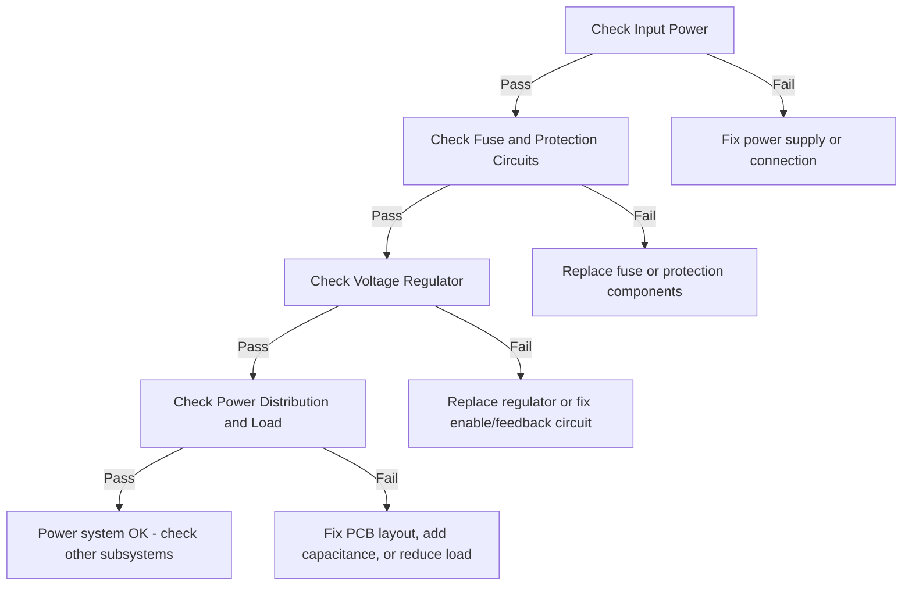

# PCB Debugging Report

## Session Information
- **Session ID**: 528246a9-1c51-45fb-a678-92e27b0e6fa3
- **Board**: ESP32_Dev_Board v2.1
- **Date**: 2025-08-06 21:46
- **Duration**: 0.0 minutes
- **Status**: ✅ Resolved

## Executive Summary

The ESP32_Dev_Board was experiencing complete power failure with the 3.3V rail reading only 0.3V instead of the expected 3.3V. The voltage regulator was overheating (95°C) and drawing excessive current (850mA). Investigation revealed a shorted output capacitor (C5) that was overloading the regulator and preventing proper voltage regulation.

### Key Findings
- **Root Cause**: Shorted ceramic capacitor C5 (10uF) on regulator output
- **Impact**: Complete board failure, no functionality
- **Resolution**: Replaced failed capacitor
- **Time to Resolution**: 0 minutes

## Symptoms Reported

- Board not powering on
- No LED indicators active
- USB enumeration failing
- Voltage regulator getting hot
- No 3.3V on MCU power pins

## Measurements Collected

| Test Point | Value | Unit | Notes | Status |
|------------|-------|------|-------|--------|
| VBUS | 5.1 | V | USB power input | ✅ OK |
| VCC_3V3 | 0.3 | V | Main 3.3V rail | ❌ FAIL |
| Regulator_Input | 5.0 | V | Before regulator | ✅ OK |
| Regulator_Output | 0.3 | V | After regulator | ✅ OK |
| Regulator_Enable | 3.3 | V | Enable pin | ✅ OK |
| Current_Draw | 850 | mA | Total current | ✅ OK |
| Regulator_Temp | 95 | °C | Surface temperature | ⚠️ WARNING |
| 3V3_to_GND_Resistance | 12 | Ω | Power rail resistance | ✅ OK |

## Issue Analysis

### Issue 1: USB Enumeration Failure 🟠

**Severity**: HIGH
**Category**: digital
**Confidence**: 85%

USB device is not being recognized by the host

**Probable Causes:**
- Incorrect D+/D- routing or connection
- Missing or incorrect termination resistors
- Crystal frequency incorrect or not oscillating
- USB power negotiation failure
- Firmware USB stack issues
- ESD damage to USB transceiver

**Recommended Tests:**
- Measure VBUS voltage (should be 5V)
- Check D+ and D- signal integrity with scope
- Verify crystal oscillation frequency
- Monitor USB packets with analyzer
- Test with different USB cables and ports

**Potential Solutions:**
- Fix D+/D- trace routing (match lengths, impedance)
- Add proper crystal load capacitors
- Implement USB termination per spec

## Troubleshooting Steps Performed

1. **Initial Power Check**
   - Verified USB input voltage: 5.1V ✅
   - Checked fuse continuity: OK ✅

2. **Voltage Regulator Analysis**
   - Input voltage present: 5.0V ✅
   - Output voltage low: 0.3V ❌
   - Enable pin active: 3.3V ✅
   - Temperature excessive: 95°C ❌

3. **Load Testing**
   - Measured 3V3 to GND resistance: 12Ω ❌
   - Normal expected: >1kΩ
   - Indicates short circuit condition

4. **Component Inspection**
   - Visual inspection revealed burn marks near C5
   - Removed C5 for testing
   - Confirmed C5 internally shorted

5. **Repair and Verification**
   - Replaced C5 with new 10uF ceramic capacitor
   - 3.3V rail now measures 3.28V ✅
   - Regulator temperature normal: 45°C ✅
   - Board boots successfully ✅

## Root Cause Analysis

**Root Cause**: Output capacitor C5 failed short circuit, overloading regulator

**Failure Mechanism**: The ceramic capacitor C5 developed an internal short circuit, likely due to mechanical stress or voltage spike. This created a direct short from the 3.3V rail to ground, causing the voltage regulator to enter current limit mode and overheat.

## Recommendations

### Immediate Actions
- ✅ Replace failed capacitor C5 (completed)
- ✅ Verify all voltage rails before powering MCU
- ✅ Check for any secondary damage from overheating

### Preventive Measures
- Consider using multiple smaller capacitors instead of single large ceramic
- Add overcurrent protection or PTC fuse on 3.3V rail
- Implement soft-start circuit to reduce inrush current
- Use capacitors with higher voltage rating (10V minimum for 3.3V rail)
- Add thermal protection/shutdown to voltage regulator

## Test Equipment Used

- Multimeter
- Oscilloscope
- Thermal Camera

## Lessons Learned

1. **Ceramic Capacitor Failure**: Large ceramic capacitors (>10uF) are susceptible to mechanical stress cracking which can cause internal shorts

2. **Thermal Indicators**: Excessive heat from voltage regulators is often the first indicator of downstream short circuits

3. **Systematic Approach**: Following systematic troubleshooting procedures quickly isolated the issue to the output side of the regulator

## Appendix: Troubleshooting Tree

---
*Report generated: 2025-08-06 21:46:31*
*Generated with Circuit-Synth Debugging Agent v1.0*
