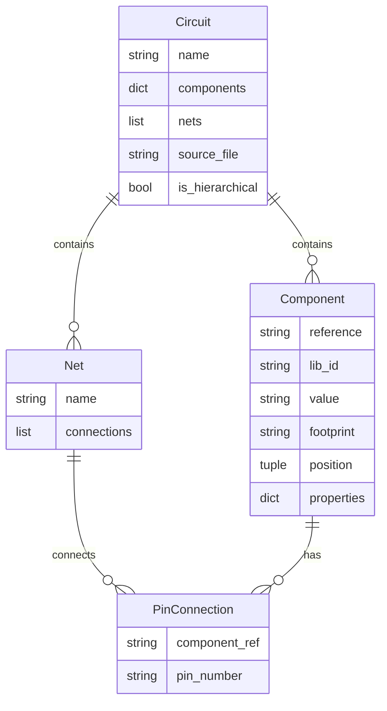

# ERD: Import KiCad Project API Data Models

**Related**: PRD_IMPORT_KICAD_PROJECT_API.md
**Created**: 2025-01-27

---

## Entity Relationship Diagram



## Data Model Details

### Circuit (circuit_synth.core.circuit.Circuit)

**Primary entity** returned by `import_kicad_project()`.

```python
class Circuit:
    """Main circuit object"""
    name: str                          # Circuit name from KiCad
    components: Dict[str, Component]   # Components indexed by reference
    nets: List[Net]                    # Net connections
    source_file: str                   # Original .kicad_sch file
    is_hierarchical: bool              # Has subcircuits?

    # Methods
    def generate_kicad_project(...)    # Export to KiCad
    def add_component(...)             # Add component
    def add_net(...)                   # Add net
```

**Relationships:**
- **Has many** Components (1:N)
- **Has many** Nets (1:N)

---

### Component (circuit_synth.core.component.Component)

**Component entity** representing KiCad schematic symbols.

```python
class Component:
    """Electronic component"""
    reference: str        # e.g., "R1", "C1", "U1"
    lib_id: str           # e.g., "Device:R", "Device:C"
    value: str            # e.g., "10k", "100nF"
    footprint: str        # e.g., "Resistor_SMD:R_0603_1608Metric"
    position: Tuple[float, float]  # (x, y) in mm
    properties: Dict[str, str]     # Additional properties

    # Methods
    def __getitem__(pin: int)  # Access pins for net connections
```

**Relationships:**
- **Belongs to** Circuit (N:1)
- **Has many** PinConnections (1:N)

**Attributes:**
- `reference`: Unique identifier within circuit
- `lib_id`: KiCad symbol library reference
- `value`: Component value (resistance, capacitance, etc.)
- `footprint`: PCB footprint for layout
- `position`: Schematic position (preserved on import)

---

### Net (circuit_synth.core.net.Net)

**Net entity** representing electrical connections.

```python
class Net:
    """Electrical connection between pins"""
    name: str                      # e.g., "GND", "VCC", "NET1"
    connections: List[Tuple[str, str]]  # [(comp_ref, pin_num), ...]

    # Methods
    def __iadd__(pin)   # Add pin to net: net += component[1]
```

**Relationships:**
- **Belongs to** Circuit (N:1)
- **Connects many** PinConnections (1:N)

**Attributes:**
- `name`: Net name (user-defined or auto-generated)
- `connections`: List of (component_ref, pin_number) tuples

---

### PinConnection (Implicit Relationship)

**Not a separate class** - represented as tuples in Net.connections.

```python
# Format: (component_reference, pin_number)
("R1", "1")      # Pin 1 of R1
("C1", "2")      # Pin 2 of C1
("U1", "VCC")    # VCC pin of U1
```

---

## Data Flow Through Import

### 1. Input: KiCad Project Files

```
my_project/
├── my_project.kicad_pro    # Project file
├── my_project.kicad_sch    # Schematic
└── my_project.json         # Generated netlist (optional)
```

### 2. Parse to JSON

```json
{
  "name": "my_project",
  "components": {
    "R1": {
      "ref": "R1",
      "symbol": "Device:R",
      "value": "10k",
      "footprint": "Resistor_SMD:R_0603_1608Metric"
    },
    "C1": {
      "ref": "C1",
      "symbol": "Device:C",
      "value": "100nF",
      "footprint": "Capacitor_SMD:C_0603_1608Metric"
    }
  },
  "nets": {
    "NET1": [
      {"component": "R1", "pin_id": 1},
      {"component": "C1", "pin_id": 1}
    ]
  }
}
```

### 3. Convert to models.Circuit (Intermediate)

```python
# From tools/utilities/models.py
models_circuit = Circuit(
    name="my_project",
    components=[
        Component(
            reference="R1",
            lib_id="Device:R",
            value="10k",
            footprint="Resistor_SMD:R_0603_1608Metric",
            position=(100.0, 100.0)
        ),
        Component(
            reference="C1",
            lib_id="Device:C",
            value="100nF",
            footprint="Capacitor_SMD:C_0603_1608Metric",
            position=(150.0, 100.0)
        )
    ],
    nets=[
        Net(
            name="NET1",
            connections=[("R1", "1"), ("C1", "1")]
        )
    ]
)
```

### 4. Convert to circuit_synth.Circuit (Final)

```python
# From core/circuit.py
circuit = Circuit(name="my_project")

# Add components
circuit.components["R1"] = Component(...)
circuit.components["C1"] = Component(...)

# Add nets
net1 = Net(name="NET1")
net1 += circuit.components["R1"][1]
net1 += circuit.components["C1"][1]
circuit.nets.append(net1)
```

---

## Type System Investigation

### Question: Are these the same?

1. **`tools.utilities.models.Circuit`** (used in CLI)
2. **`core.circuit.Circuit`** (main API)

**Need to check:**
- Are they the same class?
- Are they compatible?
- Do we need conversion logic?

### Files to Investigate

```
src/circuit_synth/
├── tools/utilities/models.py          # CLI models
│   ├── Circuit
│   ├── Component
│   └── Net
│
└── core/
    ├── circuit.py                     # Main API Circuit
    ├── component.py                   # Main API Component
    └── net.py                         # Main API Net
```

---

## Conversion Requirements

If `models.Circuit` ≠ `circuit_synth.Circuit`, need conversion:

```python
def _convert_to_circuit_synth_circuit(
    models_circuit: models.Circuit
) -> circuit_synth.Circuit:
    """Convert CLI models.Circuit to API Circuit"""

    # Create circuit
    circuit = circuit_synth.Circuit(name=models_circuit.name)

    # Convert components
    for comp in models_circuit.components:
        circuit.components[comp.reference] = circuit_synth.Component(
            ref=comp.reference,
            symbol=comp.lib_id,
            value=comp.value,
            footprint=comp.footprint,
            # ... other fields
        )

    # Convert nets
    for net in models_circuit.nets:
        cs_net = circuit_synth.Net(name=net.name)
        for comp_ref, pin_num in net.connections:
            comp = circuit.components[comp_ref]
            cs_net += comp[int(pin_num) if pin_num.isdigit() else pin_num]
        circuit.nets.append(cs_net)

    return circuit
```

---

## Data Validation

### Input Validation

```python
# Valid inputs
import_kicad_project("project.kicad_pro")  # ✅ KiCad project
import_kicad_project("project.json")       # ✅ JSON netlist (preferred)
import_kicad_project("/path/to/project/")  # ✅ Project directory

# Invalid inputs
import_kicad_project("nonexistent.kicad_pro")  # ❌ FileNotFoundError
import_kicad_project("invalid.txt")            # ❌ ValueError
```

### Circuit Validation

```python
# Valid circuit
circuit = Circuit(
    name="valid",
    components={"R1": Component(...)},
    nets=[Net(name="NET1", connections=[("R1", "1")])]
)

# Invalid circuit
circuit = Circuit(
    name="",  # ❌ Empty name
    components={},  # ⚠️  No components (warning?)
    nets=[Net(name="NET1", connections=[("R99", "1")])]  # ❌ Invalid ref
)
```

---

## Alternative Designs Considered

### Design A: Separate Functions (Rejected)

```python
def load_kicad_json(json_path: str) -> dict:
    """Load JSON netlist"""

def json_to_circuit(json_data: dict) -> Circuit:
    """Convert JSON to Circuit"""

def import_kicad_project(kicad_project: str) -> Circuit:
    """High-level import (uses above)"""
```

**Pros:** Modular, testable
**Cons:** Too many functions, confusing API

### Design B: Class-Based (Rejected)

```python
class KiCadImporter:
    def __init__(self, kicad_project: str):
        ...

    def load(self) -> Circuit:
        ...

    def preview(self) -> str:
        ...
```

**Pros:** Object-oriented, stateful
**Cons:** Overkill for simple operation, matches CLI not API style

### Design C: Single Function (Selected)

```python
def import_kicad_project(
    kicad_project: str,
    **options
) -> Circuit:
    """One function, all options"""
```

**Pros:** Simple, Pythonic, matches export API
**Cons:** May need many parameters

---

## Questions for User

### Critical Path Questions

1. **Type compatibility**:
   - Are `models.Circuit` and `circuit_synth.Circuit` the same class?
   - Location of each: `tools/utilities/models.py` vs `core/circuit.py`
   - Need conversion function?

2. **API style**:
   - Should match `generate_kicad_project()` style?
   - Simple function or class-based?

3. **Return types**:
   - Always return Circuit?
   - Support returning just components/nets?
   - Return tuple (circuit, metadata)?

### Nice-to-Have Questions

4. **Position preservation**:
   - Are positions stored in JSON?
   - Need special handling for position import?

5. **Hierarchical circuits**:
   - Support subcircuits in V1?
   - Flatten or preserve hierarchy?

6. **Error recovery**:
   - Partial import on errors?
   - Or fail-fast?

---

**Next Steps:**
1. User answers questions above
2. Investigate type system (`models.Circuit` vs `circuit_synth.Circuit`)
3. Begin implementation once clarity achieved
