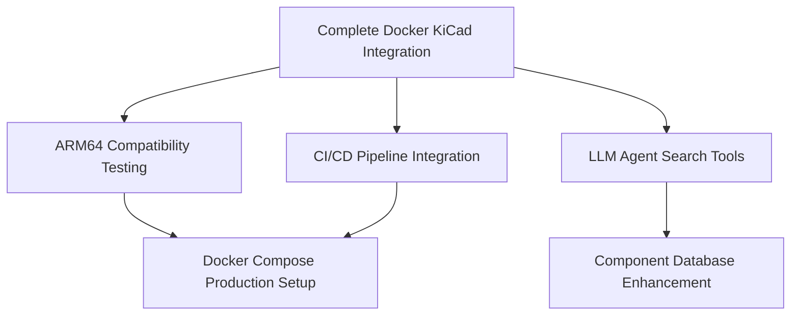

# Circuit-Synth Active Tasks - 2025-07-27

## High Priority Tasks

### 1. Complete Docker KiCad Integration 🚧
**Status**: In Progress - Basic container working, KiCad libraries needed  
**Priority**: HIGH  
**Estimated Time**: 30-60 minutes  

**Next Steps**:
- [ ] Download KiCad symbol and footprint libraries
- [ ] Test examples/example_kicad_project.py with mounted KiCad libraries
- [ ] Verify generated KiCad project files in output directory
- [ ] Document successful Docker workflow

**Ready Commands**:
```bash
mkdir -p kicad-libraries output
git clone --depth=1 https://gitlab.com/kicad/libraries/kicad-symbols.git kicad-libraries/symbols
git clone --depth=1 https://gitlab.com/kicad/libraries/kicad-footprints.git kicad-libraries/footprints
```

### 2. LLM Agent Search Tools Development 📋
**Status**: Pending (Phase 2 of LLM integration)  
**Priority**: MEDIUM  
**Dependencies**: Docker setup completion  

**Subtasks**:
- [ ] Investigate existing search capabilities in codebase
- [ ] Implement/enhance symbol search functionality
- [ ] Implement/enhance footprint search functionality
- [ ] Create LLM-friendly search API

### 3. Component Database Enhancement 📋
**Status**: Pending (Phase 3 of LLM integration)  
**Priority**: MEDIUM  
**Dependencies**: Search tools completion  

**Subtasks**:
- [ ] Build comprehensive symbol reference database
- [ ] Build comprehensive footprint reference database
- [ ] Include component descriptions and use cases
- [ ] Add pin mapping information for complex parts

## Medium Priority Tasks

### 4. ARM64 Docker Compatibility Testing 📋
**Status**: Not Started  
**Priority**: MEDIUM  
**Context**: Multiple sophisticated Docker configs available but need ARM64 testing  

**Files to Test**:
- docker/Dockerfile.kicad-integrated (multi-stage with KiCad nightly)
- docker/Dockerfile.kicad-emulated (cross-platform emulation)
- docker/Dockerfile.kicad-production (production-ready with fallbacks)

### 5. CI/CD Pipeline Integration 📋
**Status**: Not Started  
**Priority**: MEDIUM  
**Dependencies**: Docker workflow completion  

**Subtasks**:
- [ ] Integrate Docker containers into automated testing
- [ ] Set up regression testing with containerized environment
- [ ] Document CI/CD workflow with Docker

## Low Priority / Future Enhancements

### 6. Docker Compose Production Setup 📋
**Status**: Available but not tested  
**Priority**: LOW  
**Context**: Multiple docker-compose configurations ready for deployment  

### 7. Cross-Platform Development Environment 📋
**Status**: Foundation Available  
**Priority**: LOW  
**Context**: Architecture detection scripts and cross-platform Docker configs ready  

## Recently Completed ✅

### Circuit-Synth Claude Agent Development
**Completed**: 2025-07-27  
**Impact**: AI-powered code review and guidance system  
**Files**: .claude/agents/circuit-synth.md, README.md updates  

### Basic Docker Container
**Completed**: 2025-07-27  
**Impact**: Working containerized Circuit-Synth environment  
**Container**: circuit-synth:simple  

## Task Dependencies



## Active Development Session Priorities

**Current Focus**: Docker KiCad Integration completion  
**Blocking**: None - ready commands available  
**Next Session Goal**: Have fully functional Docker environment with KiCad support  
**Success Criteria**: examples/example_kicad_project.py runs successfully in Docker container  

## Resource Allocation

**Time Investment Estimates**:
- Docker KiCad Integration: 30-60 minutes (HIGH PRIORITY)
- LLM Search Tools: 2-4 hours (MEDIUM PRIORITY)
- Component Database: 4-8 hours (MEDIUM PRIORITY)
- ARM64 Testing: 1-2 hours (MEDIUM PRIORITY)

**Skills Required**:
- Docker containerization (current focus)
- Python development (ongoing)
- KiCad library management (current focus)
- LLM integration (upcoming)